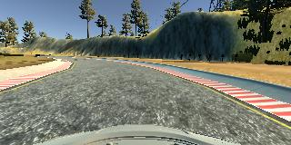
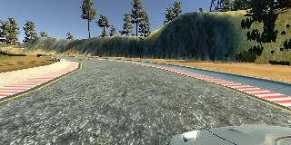
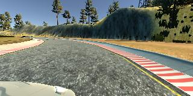

# **Behavioral Cloning** 

---

The goals / steps of this project are the following:
* Use a simulator to collect data of good driving behavior
* Build a convolution neural network in Keras that predicts steering angles from images
* Train and validate the model with a training and validation set
* Test that the model successfully drives around track one without leaving the road
* Summarize the results with a written report


#### The Github instructions for this project can be found here : [Github](https://github.com/udacity/CarND-Behavioral-Cloning-P3)
#### The Rubric for this project can be found here : [rubric points](https://review.udacity.com/#!/rubrics/432/view)
#### The Simlutor for this project can be found here : [Simulator](https://github.com/udacity/self-driving-car-sim)
#### The Class for this project can be found here : [UdaCity](https://www.udacity.com/course/self-driving-car-engineer-nanodegree--nd013)


---
### Files

This project includes the following files:
* model.py containing the script to create and train our model
* model_tune.py for fine tuning models after orriginal training.
* drive.py for driving the car in autonomous mode
* model.h5 containing a trained convolution neural network 
* writeup_report.md or writeup_report.pdf summarizing the results


Using the [simulator](https://github.com/udacity/self-driving-car-sim)  ([more info](http://sdtimes.com/sd-times-github-project-week-udacity-self-driving-car-simulator/))and my drive.py file, the car can be driven autonomously around the track by executing 
```sh
python drive.py model.h5
```

The model.py file contains the code for training and saving the the network. The file shows the pipeline I used for training and validating the model, and contains comments to explain how the code works. model_tune.py can also be used to further fine tune a model after a model.h5 file is generated from model.py. If you have any questions of comments, don't be afraid to send me a message or post a commnet.

### Model Architecture and Training Strategy

My model follows the Nvidia Architecture descirbed in [this paper](http://images.nvidia.com/content/tegra/automotive/images/2016/solutions/pdf/end-to-end-dl-using-px.pdf), which was developed for a purpose very similar to this project. The Nvidia architecture was empirically derived from real camera data taken from moving vehicles and was used to train/test a simulated car. One distinction between my model and the Nvidia model is that my model employs a (160, 320, 3) input layer shape and then crops this to (65, 320, 30), whereas the Nvidai model uses a (66, 200, 3) input layer shape. This decision was made in order to increase training speed on my local machine by decreasing preproccessing of the thousands of image files.

The model uses 5 Convolutional layers which increase in depth through the course of the pipeline, ending in 3 fully connected layers which decrease in size until a single output layer is reached.

The model includes ELU layers to introduce nonlinearity without creating dead neurons, and the data is normalized using a Keras lambda layer during input. Additionally the model employs a train-test-split  (code line 32) in order to shuffle our data and provide a validation set to measure our models accuracy against. Furthermore the model uses dropout layers in order to reduce overfitting and increase accuracy. The full model architecture implementation can be viewed on code lines 102-119, and a picture of the model architecture can be view below.

**Nvidia Model**


The model used an Adam Optimizer, so the learning rate was left at it's default value as semi-suggested by the [Keras Docs](https://keras.io/optimizers/#adam). the Adam optimizer was chosen due to it's performance with non stationary objectives, suitability for large amounts of data, and resistance to hyperparameter tuning (less guess-wait-and-check).

Future work will explore using Adamax Optimizer in order to explore increased stability due to noisey gradient changes (human error while driving).


### Training data

The training data was collected by recording select driving sessions in the windows simulator application. The following data sets  were collected.

|Data Type |Qty.|
| :---: | :---: |
| Middle Lane Driving | 3 laps  |
| Edge Avoidance Driving | 1 lap  |
| Last Right Turn  | 1 laps  |
| Second Track | 1 lap  |




**Center Image**


Each session has a series of center camera + driving angle pairs associated with it. This dataset was enhanced by adding additional left/right camera pictures, and adding a small adjustment factor to the angle in order to account for the changed perspective (code line 40).



**Left Image**



**Right Image**

The dataset was then further enhanced by flipping the data from all 3 cameras by 180 degrees about the Y axis using the cv2 library (code line 78), and inverting the steering angle. This was done in order to prevent bias against left turning angles, as the majority of our track consisted of left turns.


### Design Approach

The design approach was to create an initially trained model which could successfully navigate most of the course under our architecture, and then fine tune the model to increase performance in specific areas. In order to accomplish this model checkpoints were created and tested individually on the simulator. The best performing checkpoint would then be used as the base to fine tune the model (using model_tune.py) with supplimental datasets to better handle problem situations ("Mud Gate"). Checkpoints were again used for the fine tuned models and the best was selected as our final model.

A LeNet architecture was first implemented in order to approach a solution. After some amount of testing it became apparent that our training and validation accuracy was high, and our solution performance was low. This suggested more training data was required and was so collected. Performance did not increase sufficiently with the increase of training data on the LeNet architecture, so a new architecture was sought. After performing a brief materials search the Nvidia architecture was deployed. 

The Nvidia architecture performed very well, and required only a few extra data for specific difficulties in the track. Mainly difficulties with a final right turn in the track. After additional training the prior problem was fixed, however a previously non-existant problem arose, ("MudGate"), and a second supplimental dataset was collected. After applying both supplimental datasets, the simulator was able to complete the track in autonomous mode.

Addtional note: During testing it became apparent that the dataset required too much memory for my machine, so a generator was employed as a memory managment measure. This allowed for an increased dataset, which when trained included over 100,000+ image + angle pairs.
